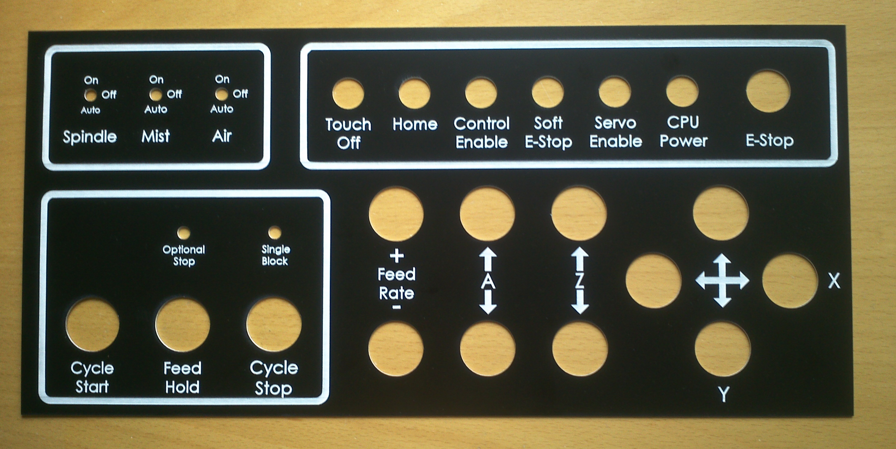

***

# Acrylic (Plexiglass, PMMA)

**Method**: Samples of clear acrylic placed in the center of the cut bed and the laser was focused to roughly half their thickness using the 58 mm focus key. One inch cut lines were made at 100% current and 100% power with the speed reduced until a clean cut was made. Kerfs were estimated using the graduated loupe. 

<table>
 <thead>
  <tr><th>Thickness [mm]</th><th>Cut Speed (at 100% power)</th><th>Kerf (mm)</th></tr>
 </thead>
 <tbody>
  <tr><td> 1.60</td><td>90%</td><td>0.2 &ndash; 0.4</td></tr>
  <tr><td> 2.34</td><td>80%</td><td>0.2 &ndash; 0.4</td></tr>
  <tr><td> 2.85</td><td>60%</td><td>0.2 &ndash; 0.5</td></tr>
  <tr><td> 4.50</td><td>30%</td><td>0.2 &ndash; 1.0</td></tr>
  <tr><td> 5.80</td><td>20%</td><td>0.2 &ndash; 1.0</td></tr>
  <tr><td>12.13</td><td> 5%</td><td>0.5 &ndash; 2.0</td></tr>
 </tbody>
</table>

#### Chart

The above experimental values were charted and found that cut power was roughly exponential with thickness.

The fit curve is found to be:

### Etching

100% Speed, 10% power for marklines?

***

# Bamboo Plywood

**Method**: Samples of bamboo plywood placed in the center of the cut bed and the laser was focused to roughly half their thickness using the 58 mm focus key. One inch cut lines were made at 100% current and 100% power with the speed reduced until a clean cut was made. Kerfs were estimated using the graduated loupe.

Thickness [mm] | Cut Speed (at 100% power)
 ------------- | -------------------------
      3.17     |  60%
      6.53     |  28%

#### Raster:

**Method**: Bamboo was placed on the bed and focused to the surface height. A series of 1/4 inch squares were cut at 500 dpi and varying powers/speeds. Gradients were also created for different dpis and halftoning methods.

***

# Kapton (polyimide flim)

**Method**: Sheet of kapton film was placed on bed and focused. A series of tests of various powers and speeds were performed. 

<table>
 <thead>
  <tr><th>Thickness [mil]</th><th>Raster Power</th><th>Raster Speed</th><th>Remarks</th></tr>
 </thead>
 <tbody>
  <tr><td>2</td><td>50%</td><td>40%</td><td>Slightly narrow in X axis. A little too big. Set B/W set point to 005 for smaller cut, still measured at about 1 mil too large in the X and 3 to 4 mils too large in the Y</td></tr>
<tr><td>5</td><td>75%</td><td>25%</td><td>Still a little too big. Set B/W set point to 005</td></tr>
 </tbody>
</table>

**Notes:** can mark, but not cut at 50% speed and ~25% power.

#### Calibration

The kapton is considered next to its source file.

***

# Gravoply Laser

Gravoply Laser is a 2-layer bonded acrylic, with a top layer that is etched away to reveal the bottom layer. This is useful for signage, machine UI panels, labels and a variety of other applications.

Product Details: http://www.gravograph.com/english/engraving-products/gravoply_laser.php

Can be purchased online here: http://www.gravostore.com/

### Etching 1.3mm Gravoply Laser

 - 80% Speed
 - 25% power (current)
 - 500 DPI

### Cutting 1.3mm Gravoply Laser

 - 80% speed
 - 50% power (current)
 - 100% PWM

***

# Parchment Paper (used for solder paste stencils)

 - Vector Mode
 - 25% speed
 - 8% power
 - 1 pass
 - 21% vector current (Note: for very fine pitch use, 21% vector current produced better results)

***

# Magazine Paper Solder Mask (3.5mil heavy advertising page)

 Pad size shrink 0.22mm

 - Vector Mode
 - 20% speed
 - 15% power
 - 1 pass
 - 21% vector current

***

# Paper Stencil Mask

Prepare circuit board with solder mask. Use rubber cement to glue down a piece of plain office paper. 

Run laser at

 - **Raster Mode**
 - 1000 DPI
 - 35% Power
 - 80% Speed

Then paint through the holes. Let dry then lift off paper.

***

# Paper

## 40 lb Card Stock

 - 1% current
 - 100% pwm
 - 70% speed

## 1/8 inch Corrugated Cardboard

 - 35% current
 - 100% pwm
 - 80 % speed

***

 - office paper
 - chipboard
 - kapton
  - 5 mil
 - plywood