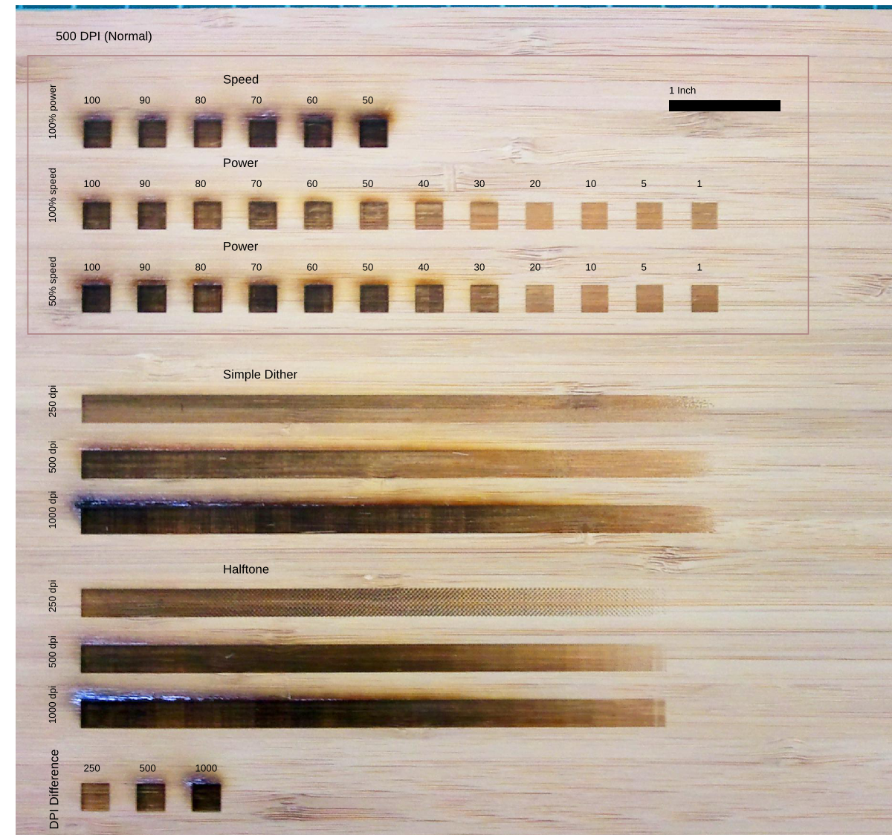

***

# Acrylic (Plexiglass, PMMA)

**Method**: Samples of clear acrylic placed in the center of the cut bed and the laser was focused to roughly half their thickness using the 58 mm focus key. One inch cut lines were made at 100% current and 100% power with the speed reduced until a clean cut was made. Kerfs were estimated using the graduated loupe. 

<table>
 <thead>
  <tr><th>Thickness [mm]</th><th>Cut Speed (at 100% power)</th><th>Kerf (mm)</th></tr>
 </thead>
 <tbody>
  <tr><td> 1.60</td><td>90%</td><td>0.2 &ndash; 0.4</td></tr>
  <tr><td> 2.34</td><td>80%</td><td>0.2 &ndash; 0.4</td></tr>
  <tr><td> 2.85</td><td>60%</td><td>0.2 &ndash; 0.5</td></tr>
  <tr><td> 4.50</td><td>30%</td><td>0.2 &ndash; 1.0</td></tr>
  <tr><td> 5.80</td><td>20%</td><td>0.2 &ndash; 1.0</td></tr>
  <tr><td>12.13</td><td> 1%</td><td>0.5 &ndash; 2.0</td></tr>
 </tbody>
</table>

#### Chart

The above experimental values were charted and found that cut power was roughly exponential with thickness.

The fit curve is found to be:

### Etching

100% Speed, 10% power for marklines?

***

# Bamboo Plywood

**Method**: Samples of bamboo plywood placed in the center of the cut bed and the laser was focused to roughly half their thickness using the 58 mm focus key. One inch cut lines were made at 100% current and 100% power with the speed reduced until a clean cut was made. Kerfs were estimated using the graduated loupe.

<table>
 <thead>
  <tr><th>Thickness [mm]</th><th>Cut Speed (at 100% power)</th><th>Kerf (mm)</th></tr>
 </thead>
 <tbody>
  <tr><td>2.87</td><td>90%</td><td>0.3 &ndash; 0.5</td></tr>
  <tr><td>6.08</td><td>35%</td><td>0.3 &ndash; 1.0</td></tr>
 </tbody>
</table>

#### Raster:

**Method**: Bamboo was placed on the bed and focused to the surface height. A series of 1/4 inch squares were cut at 500 dpi and varying powers/speeds. Gradients were also created for different dpis and halftoning methods.

***

# Kapton (polyimide flim)

**Method**: Sheet of kapton film was placed on bed and focused. A series of tests of various powers and speeds were performed. 

<table>
 <thead>
  <tr><th>Thickness [mil]</th><th>Raster Power</th><th>Raster Speed</th><th>Remarks</th></tr>
 </thead>
 <tbody>
  <tr><td>2</td><td>50%</td><td>40%</td><td>Slightly narrow in X axis. A little too big. Set B/W set point to 005 for smaller cut, still measured at about 1 mil too large in the X and 3 to 4 mils too large in the Y</td></tr>
 </tbody>
</table>

**Notes:** can mark, but not cut at 50% speed and ~25% power.

#### Calibration

The kapton is considered next to its source file.

***

# Paper

## 40 lb Card Stock

 - 1% current
 - 100% pwm
 - 70% speed

## 1/8 inch Corrugated Cardboard

 - 35% current
 - 100% pwm
 - 80 % speed
***
 - office paper
 - cardboard
 - chipboard
 - kapton
  - 2 mil
  - 5 mil
 - plywood