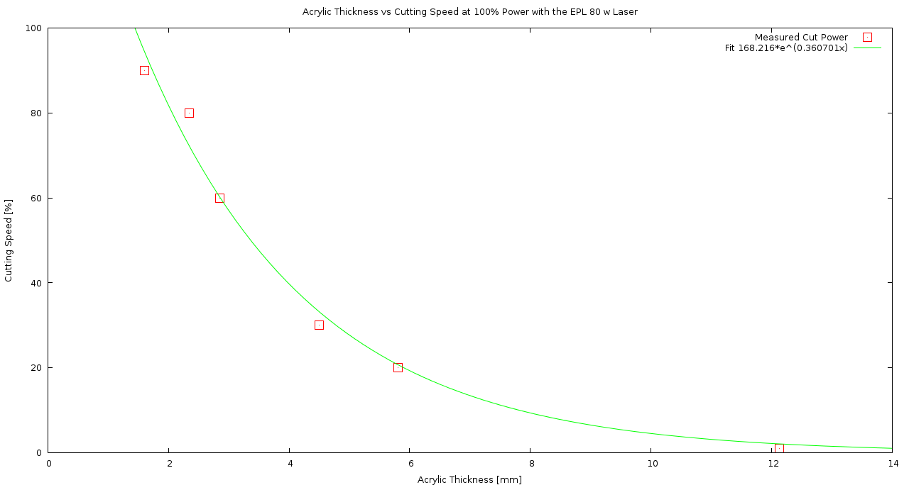
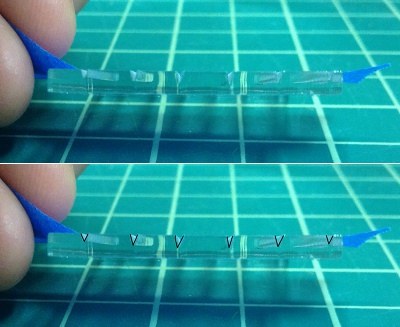
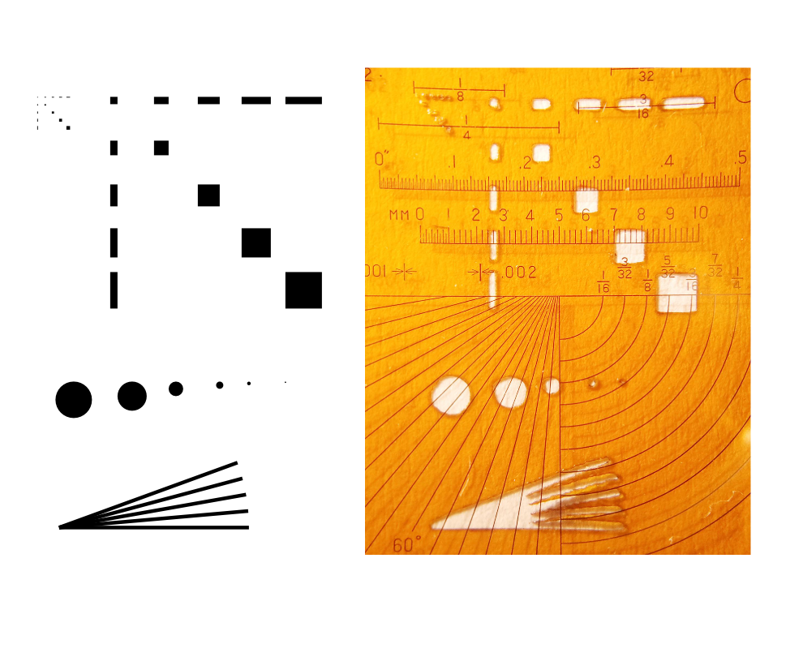
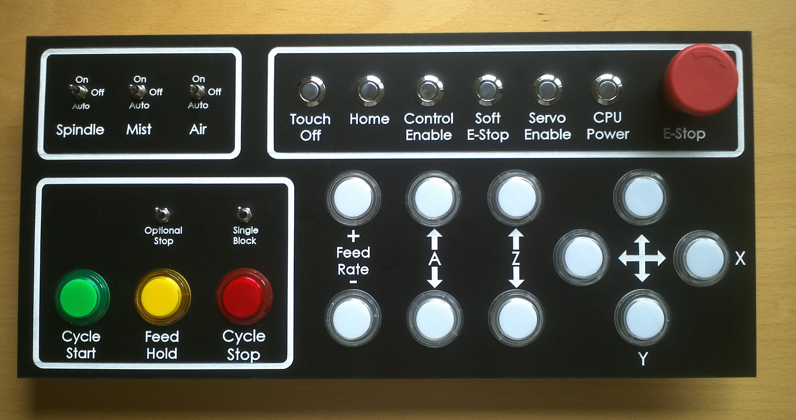

***

# Acrylic (Plexiglass, PMMA)

**Method**: Samples of clear acrylic placed in the center of the cut bed and the laser was focused to the surface of the material. Half inch squares were cut out of the material using different combinations of laser power and speed, and the setting shown below were determined by the cutout with the least about of damage done to the remaining material. Kerfs were measured by using digital calipers.

Thickness mm (in) |       Laser Settings      | Kerf mm
 ---------------- | ------------------------- | -------
    1.587 (1/16") |  Power: 40%  Speed: 100%  | 0.09
    3.175 (1/8")  |  Power: 50%  Speed: 75%   | 0.07
    4.76 (3/16")  |  Not Available Yet        | 0.15
    6.35 (1/4")   |  Power: 40%  Speed: 25%   |
    12.7 (1/2")   |(2-Pass) Power: 40%  Speed: 20% | 0.15

#### Chart

The above experimental values were charted and found that cut power was roughly exponential with thickness.

The fit curve is found to be:

### Etching

100% Speed, 10% power for marklines?

### Partial Cuts

It is possible to cut channels by varying the laser power and focus. 80% power gives v-shaped channel about halfway through 1/8" acrylic when the laser is moved up a little bit from focused.

Several channels were cut in 1/8" acrylic with 59mm, 60mm, and 61mm focus depth, and the approximate depths and widths were measured using calipers. I wouldn't trust these values too far.

Cut Speed | Cut Power | Depth (mm) | Width (mm) | Depth (mm) | Width (mm) | Depth (mm) | Width (mm)
 -------- | --------- | ---------- | ---------- | ---------- | ---------- | ---------- | ---------- 
          |           | 59mm       |            | 60mm       |            | 61mm       |
    80%   |    100%   |   2.26     |   0.50     |    1.73    |   0.44     |    1.82    |   0.62
   100%   |    100%   |   2.13     |   0.50     |    1.50    |   0.42     |    1.71    |   0.60
   100%   |     80%   |   2.05     |   0.50     |    1.25    |   0.42     |    1.51    |   0.60
   100%   |     60%   |   1.71     |   0.47     |    1.11    |   0.35     |    1.22    |   0.58
   100%   |     40%   |   1.47     |   0.45     |    0.70    |   0.33     |    0.92    |   0.56
   100%   |     20%   |   1.13     |   0.42     |    0.56    |   0.27     |    0.75    |   0.53

***
# Balsa wood

Thickness mm (in) | Cut speed (at 100% power)
------------------|--------------------------
     6.35 (1/4")  |  100%

# Bamboo Plywood

**Method**: Samples of bamboo plywood placed in the center of the cut bed and the laser was focused to roughly half their thickness using the 58 mm focus key. One inch cut lines were made at 100% current and 100% power with the speed reduced until a clean cut was made. Kerfs were estimated using the graduated loupe.

Thickness mm (in) | Cut Speed (at 100% power)
 ---------------- | -------------------------
     1.59 (1/16") |  80ish??%
     3.17 (1/8")  |  60%
     6.35 (1/4")  |  28%

#### Raster:

**Method**: Bamboo was placed on the bed and focused to the surface height. A series of 1/4 inch squares were cut at 500 dpi and varying powers/speeds. Gradients were also created for different dpis and halftoning methods.

***

# Kapton (polyimide flim)

**Method**: Sheet of kapton film was placed on bed and focused. A series of tests of various powers and speeds were performed. 

<table>
 <thead>
  <tr><th>Thickness [mil]</th><th>Raster Power</th><th>Raster Speed</th><th>Remarks</th></tr>
 </thead>
 <tbody>
  <tr><td>2</td><td>50%</td><td>40%</td><td>Slightly narrow in X axis. A little too big. Set B/W set point to 005 for smaller cut, still measured at about 1 mil too large in the X and 3 to 4 mils too large in the Y</td></tr>
<tr><td>5</td><td>75%</td><td>25%</td><td>Still a little too big. Set B/W set point to 005</td></tr>
 </tbody>
</table>

**Notes:** can mark, but not cut at 50% speed and ~25% power.

#### Calibration

The kapton is considered next to its source file.

***

# Gravoply Laser

Gravoply Laser is a 2-layer bonded acrylic, with a top layer that is etched away to reveal the bottom layer. This is useful for signage, machine UI panels, labels and a variety of other applications.

Product Details: http://www.gravograph.com/english/engraving-products/gravoply_laser.php

Can be purchased online here: http://www.gravostore.com/

### Etching 1.3mm Gravoply Laser

 - Raster Mode
 - 80% Speed
 - 25% -- 35% "Power" (current)
 - 500 DPI

### Cutting 1.3mm Gravoply Laser

 - Vector Mode
 - 80% speed
 - 50% "Power" (current)
 - 100% "Vector Current" (PWM)

***

# Parchment Paper (used for solder paste stencils)
#### Raster:
Cut Speed | Cut Power | Vector current | Kerf mm |   Half Kerf
--------- | --------- | -------------- | ------- | --------------
 80-100%  |    15%    |      28%       |   0.25  | 0.125mm (5mil)

***

# Marker Paper (user for solder paste stencils)

 - Vector Mode
 - 40% speed
 - 10% power
 - 1 pass
 - 20% vector current

***

# Magazine Paper Solder Mask (3.5mil heavy advertising page)

 Pad size shrink 0.22mm

 - Vector Mode
 - 20% speed
 - 15% power
 - 1 pass
 - 21% vector current

***

# Paper Stencil Mask

Prepare circuit board with solder mask. Use rubber cement to glue down a piece of plain office paper. 

Run laser at

 - **Raster Mode**
 - 1000 DPI
 - 35% Power
 - 80% Speed

Then paint through the holes. Let dry then lift off paper.

***

# Paper

## 40 lb Card Stock

 - 1% "Power" (current)
 - 100% "Vector current" (PWM)
 - 70% Speed

## 1/8 inch Corrugated Cardboard

 - 35% "Power" (current)
 - 100% "Vector current" (PWM)
 - 80% Speed

***

 - office paper
 - chipboard
 - kapton
  - 5 mil
 - plywood
