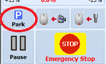

{\rtf1\ansi\deff3\adeflang1025
{\fonttbl{\f0\froman\fprq2\fcharset0 Times New Roman;}{\f1\froman\fprq2\fcharset2 Symbol;}{\f2\fswiss\fprq2\fcharset0 Arial;}{\f3\froman\fprq2\fcharset134 Liberation Serif{\*\falt Times New Roman};}{\f4\froman\fprq2\fcharset134 Liberation Sans{\*\falt Arial};}{\f5\froman\fprq2\fcharset134 Liberation Mono{\*\falt Courier New};}{\f6\froman\fprq2\fcharset134 Courier New;}{\f7\fnil\fprq2\fcharset134 Times New Roman;}{\f8\fnil\fprq2\fcharset134 Liberation Serif{\*\falt Times New Roman};}{\f9\fnil\fprq2\fcharset134 Geneva;}{\f10\fnil\fprq2\fcharset134 Courier New;}}
{\colortbl;\red0\green0\blue0;\red0\green0\blue255;\red0\green255\blue255;\red0\green255\blue0;\red255\green0\blue255;\red255\green0\blue0;\red255\green255\blue0;\red255\green255\blue255;\red0\green0\blue128;\red0\green128\blue128;\red0\green128\blue0;\red128\green0\blue128;\red128\green0\blue0;\red128\green128\blue0;\red128\green128\blue128;\red192\green192\blue192;}
{\stylesheet{\s0\snext0\ql\widctlpar\hyphpar0\ltrpar\cf1\kerning1\dbch\af8\langfe1033\dbch\af8\afs24\alang1081\loch\f3\fs24\lang1033 Normal;}
{\s15\sbasedon0\snext16\ql\widctlpar\hyphpar0\sb240\sa120\keepn\ltrpar\cf1\kerning1\dbch\af8\langfe1033\dbch\af8\afs24\loch\f4\fs28\lang1033 Heading;}
{\s16\sbasedon0\snext16\sl288\slmult1\ql\widctlpar\hyphpar0\sb0\sa140\ltrpar\cf1\kerning1\dbch\af8\langfe1033\dbch\af8\afs24\loch\f3\fs24\lang1033 Text Body;}
{\s17\sbasedon16\snext17\sl288\slmult1\ql\widctlpar\hyphpar0\sb0\sa140\ltrpar\cf1\kerning1\dbch\af8\langfe1033\dbch\af8\afs24\loch\f3\fs24\lang1033 List;}
{\s18\sbasedon0\snext18\ql\widctlpar\hyphpar0\sb120\sa120\ltrpar\cf1\i\kerning1\dbch\af8\langfe1033\dbch\af8\afs24\loch\f3\fs24\lang1033 Caption;}
{\s19\sbasedon0\snext19\ql\widctlpar\hyphpar0\ltrpar\cf1\kerning1\dbch\af8\langfe1033\dbch\af8\afs24\loch\f3\fs24\lang1033 Index;}
{\s20\sbasedon0\snext20\ql\widctlpar\hyphpar0\sb0\sa0\ltrpar\cf1\kerning1\dbch\af8\langfe1033\dbch\af8\afs24\loch\f5\fs20\lang1033 Preformatted Text;}
}{\*\generator LibreOffice/5.4.2.2$Windows_X86_64 LibreOffice_project/22b09f6418e8c2d508a9eaf86b2399209b0990f4}{\info{\title Times New Roman 12 font 1 inch margins}{\author Giando Sigurani}{\creatim\yr2018\mo9\dy7\hr12\min42}{\author Giando Sigurani}{\revtim\yr2018\mo9\dy9\hr13\min26}{\printim\yr0\mo0\dy0\hr0\min0}}{\*\userprops}\deftab709
\hyphauto0\viewscale90
{\*\pgdsctbl
{\pgdsc0\pgdscuse451\pgwsxn12240\pghsxn15840\marglsxn1440\margrsxn1440\margtsxn1440\margbsxn1440\pgdscnxt0 Default Style;}}
\formshade{\*\pgdscno0}\paperh15840\paperw12240\margl1440\margr1440\margt1440\margb1440\sectd\sbknone\sectunlocked1\pgndec\pgwsxn12240\pghsxn15840\marglsxn1440\margrsxn1440\margtsxn1440\margbsxn1440\ftnbj\ftnstart1\ftnrstcont\ftnnar\aenddoc\aftnrstcont\aftnstart1\aftnnrlc
{\*\ftnsep\chftnsep}\pgndec\pard\plain \s0\ql\widctlpar\hyphpar0\ltrpar\cf1\kerning1\dbch\af8\langfe1033\dbch\af8\afs24\alang1081\loch\f3\fs24\lang1033{\dbch\af7\dbch\af10\rtlch \ltrch\loch\loch\f6\hich\af6
---}{\rtlch \ltrch\loch
\line }{\dbch\af7\dbch\af10\rtlch \ltrch\loch\loch\f6\hich\af6
title: A406 Tool Change}{\rtlch \ltrch\loch
\line }{\dbch\af7\dbch\af10\rtlch \ltrch\loch\loch\f6\hich\af6
layout: doc}{\rtlch \ltrch\loch
\line }{\dbch\af7\dbch\af10\rtlch \ltrch\loch\loch\f6\hich\af6
author:}{\rtlch \ltrch\loch
\line }{\dbch\af7\dbch\af10\rtlch \ltrch\loch\loch\f6\hich\af6
date:}{\rtlch \ltrch\loch
\line \line }{\dbch\af7\dbch\af10\rtlch \ltrch\loch\loch\f6\hich\af6
---}
\par \pard\plain \s0\ql\widctlpar\hyphpar0\ltrpar\cf1\kerning1\dbch\af8\langfe1033\dbch\af8\afs24\alang1081\loch\f3\fs24\lang1033{\dbch\af10\rtlch \ltrch\loch\loch\f6\hich\af6
## Tool Change Guide }
\par \pard\plain \s0\ql\widctlpar\hyphpar0\ltrpar\cf1\kerning1\dbch\af8\langfe1033\dbch\af8\afs24\alang1081\loch\f3\fs24\lang1033\dbch\af10\rtlch \ltrch\loch\loch\f6\hich\af6

\par \pard\plain \s0\ql\widctlpar\hyphpar0\ltrpar\cf1\kerning1\dbch\af8\langfe1033\dbch\af8\afs24\alang1081\loch\f3\fs24\lang1033{\dbch\af10\rtlch \ltrch\loch\loch\f6\hich\af6
To change or replace a tool, you can either use the wizard in PhCNC, or you can follow these instructions. }
\par \pard\plain \s0\ql\widctlpar\hyphpar0\ltrpar\cf1\kerning1\dbch\af8\langfe1033\dbch\af8\afs24\alang1081\loch\f3\fs24\lang1033\dbch\af10\rtlch \ltrch\loch\loch\f6\hich\af6

\par \pard\plain \s0\ql\widctlpar\hyphpar0\ltrpar\cf1\kerning1\dbch\af8\langfe1033\dbch\af8\afs24\alang1081\loch\f3\fs24\lang1033\rtlch \ltrch\loch

\par \pard\plain \s0\ql\widctlpar\hyphpar0\ltrpar\cf1\kerning1\dbch\af8\langfe1033\dbch\af8\afs24\alang1081\loch\f3\fs24\lang1033{\dbch\af10\rtlch \ltrch\loch\loch\f6\hich\af6
#}{\dbch\af10\rtlch \ltrch\loch\loch\f6\hich\af6
Pull the tool and open the machine control panel }
\par \pard\plain \s0\ql\widctlpar\hyphpar0\ltrpar\cf1\kerning1\dbch\af8\langfe1033\dbch\af8\afs24\alang1081\loch\f3\fs24\lang1033\rtlch \ltrch\loch

\par \pard\plain \s0\ql\widctlpar\hyphpar0\ltrpar\cf1\kerning1\dbch\af8\langfe1033\dbch\af8\afs24\alang1081\loch\f3\fs24\lang1033{\dbch\af10\rtlch \ltrch\loch\loch\f6\hich\af6
Pull the tool you need to replace from the tool holder. In this example, tool 9 was pulled out. }
\par \pard\plain \s0\ql\widctlpar\hyphpar0\ltrpar\cf1\kerning1\dbch\af8\langfe1033\dbch\af8\afs24\alang1081\loch\f3\fs24\lang1033\rtlch \ltrch\loch

\par \pard\plain \s0\ql\widctlpar\hyphpar0\ltrpar\cf1\kerning1\dbch\af8\langfe1033\dbch\af8\afs24\alang1081\loch\f3\fs24\lang1033{\dbch\af10\rtlch \ltrch\loch\loch\f6\hich\af6
Go into CNC mode and hit \uc2 \u8220\'a1\'b0Park.\u8221\'a1\'b1 \uc1 }{\dbch\af10\rtlch \ltrch\loch\loch\f6\hich\af6
Make sure it is not in Emergency Stop mode. }
\par \pard\plain \s0\ql\widctlpar\hyphpar0\ltrpar\cf1\kerning1\dbch\af8\langfe1033\dbch\af8\afs24\alang1081\loch\f3\fs24\lang1033\rtlch \ltrch\loch

\par \pard\plain \s0\ql\widctlpar\hyphpar0\ltrpar\cf1\kerning1\dbch\af8\langfe1033\dbch\af8\afs24\alang1081\loch\f3\fs24\lang1033\sl240\slmult1\li0\ri0\lin0\rin0\fi0\sb0\sa0{\dbch\af9\dbch\af10\rtlch \ltrch\loch\loch\f6\hich\af6
 }
\par \pard\plain \s0\ql\widctlpar\hyphpar0\ltrpar\cf1\kerning1\dbch\af8\langfe1033\dbch\af8\afs24\alang1081\loch\f3\fs24\lang1033\sl240\slmult1\li0\ri0\lin0\rin0\fi0\sb0\sa0\rtlch \ltrch\loch

\par \pard\plain \s0\ql\widctlpar\hyphpar0\ltrpar\cf1\kerning1\dbch\af8\langfe1033\dbch\af8\afs24\alang1081\loch\f3\fs24\lang1033\sl240\slmult1\li0\ri0\lin0\rin0\fi0\sb0\sa0{\dbch\af9\dbch\af10\rtlch \ltrch\loch\loch\f6\hich\af6
Next you will have to go to the ATC Control Panel }
\par \pard\plain \s0\ql\widctlpar\hyphpar0\ltrpar\cf1\kerning1\dbch\af8\langfe1033\dbch\af8\afs24\alang1081\loch\f3\fs24\lang1033\sl240\slmult1\li0\ri0\lin0\rin0\fi0\sb0\sa0\rtlch \ltrch\loch

\par \pard\plain \s0\ql\widctlpar\hyphpar0\ltrpar\cf1\kerning1\dbch\af8\langfe1033\dbch\af8\afs24\alang1081\loch\f3\fs24\lang1033\sl240\slmult1\li0\ri0\lin0\rin0\fi0\sb0\sa0{\dbch\af9\dbch\af10\rtlch \ltrch\loch\loch\f6\hich\af6
 }
\par \pard\plain \s0\ql\widctlpar\hyphpar0\ltrpar\cf1\kerning1\dbch\af8\langfe1033\dbch\af8\afs24\alang1081\loch\f3\fs24\lang1033\sl240\slmult1\li0\ri0\lin0\rin0\fi0\sb0\sa0\rtlch \ltrch\loch

\par \pard\plain \s0\ql\widctlpar\hyphpar0\ltrpar\cf1\kerning1\dbch\af8\langfe1033\dbch\af8\afs24\alang1081\loch\f3\fs24\lang1033\sl240\slmult1\li0\ri0\lin0\rin0\fi0\sb0\sa0{\dbch\af9\dbch\af10\rtlch \ltrch\loch\loch\f6\hich\af6
Even though you have pulled the tool, PhCNC still doesn\uc2 \u8217\'a1\'aft know that its tool holder slot is empty. Run \uc1 }{\dbch\af9\dbch\af10\rtlch \ltrch\loch\loch\f6\hich\af6
\uc2 \u8220\'a1\'b0Tool Holders check.\u8221\'a1\'b1\uc1 }
\par \pard\plain \s0\ql\widctlpar\hyphpar0\ltrpar\cf1\kerning1\dbch\af8\langfe1033\dbch\af8\afs24\alang1081\loch\f3\fs24\lang1033\sl240\slmult1\li0\ri0\lin0\rin0\fi0\sb0\sa0\rtlch \ltrch\loch

\par \pard\plain \s0\ql\widctlpar\hyphpar0\ltrpar\cf1\kerning1\dbch\af8\langfe1033\dbch\af8\afs24\alang1081\loch\f3\fs24\lang1033\sl240\slmult1\li0\ri0\lin0\rin0\fi0\sb0\sa0{\dbch\af9\dbch\af10\rtlch \ltrch\loch\loch\f6\hich\af6
Now you should see that the tool you pulled is blank in the list. }
\par \pard\plain \s0\ql\widctlpar\hyphpar0\ltrpar\cf1\kerning1\dbch\af8\langfe1033\dbch\af8\afs24\alang1081\loch\f3\fs24\lang1033\sl240\slmult1\li0\ri0\lin0\rin0\fi0\sb0\sa0\rtlch \ltrch\loch

\par \pard\plain \s0\ql\widctlpar\hyphpar0\ltrpar\cf1\kerning1\dbch\af8\langfe1033\dbch\af8\afs24\alang1081\loch\f3\fs24\lang1033\sl240\slmult1\li0\ri0\lin0\rin0\fi0\sb0\sa0{\dbch\af9\dbch\af10\rtlch \ltrch\loch\loch\f6\hich\af6
 }
\par \pard\plain \s0\ql\widctlpar\hyphpar0\ltrpar\cf1\kerning1\dbch\af8\langfe1033\dbch\af8\afs24\alang1081\loch\f3\fs24\lang1033\sl240\slmult1\li0\ri0\lin0\rin0\fi0\sb0\sa0\rtlch \ltrch\loch

\par \pard\plain \s0\ql\widctlpar\hyphpar0\ltrpar\cf1\kerning1\dbch\af8\langfe1033\dbch\af8\afs24\alang1081\loch\f3\fs24\lang1033\sl240\slmult1\li0\ri0\lin0\rin0\fi0\sb0\sa0{\dbch\af9\dbch\af10\rtlch \ltrch\loch\loch\f6\hich\af6
#Replace the tool}
\par \pard\plain \s0\ql\widctlpar\hyphpar0\ltrpar\cf1\kerning1\dbch\af8\langfe1033\dbch\af8\afs24\alang1081\loch\f3\fs24\lang1033\sl240\slmult1\li0\ri0\lin0\rin0\fi0\sb0\sa0\rtlch \ltrch\loch

\par \pard\plain \s0\ql\widctlpar\hyphpar0\ltrpar\cf1\kerning1\dbch\af8\langfe1033\dbch\af8\afs24\alang1081\loch\f3\fs24\lang1033\sl240\slmult1\li0\ri0\lin0\rin0\fi0\sb0\sa0{\dbch\af9\dbch\af10\rtlch \ltrch\loch\loch\f6\hich\af6
Double click on the newly-empty tool. You should get a popup instructing you to change the tool. }
\par \pard\plain \s0\ql\widctlpar\hyphpar0\ltrpar\cf1\kerning1\dbch\af8\langfe1033\dbch\af8\afs24\alang1081\loch\f3\fs24\lang1033\sl240\slmult1\li0\ri0\lin0\rin0\fi0\sb0\sa0\rtlch \ltrch\loch

\par \pard\plain \s0\ql\widctlpar\hyphpar0\ltrpar\cf1\kerning1\dbch\af8\langfe1033\dbch\af8\afs24\alang1081\loch\f3\fs24\lang1033\sl240\slmult1\li0\ri0\lin0\rin0\fi0\sb0\sa0{\dbch\af9\dbch\af10\rtlch \ltrch\loch\loch\f6\hich\af6
}
\par \pard\plain \s0\ql\widctlpar\hyphpar0\ltrpar\cf1\kerning1\dbch\af8\langfe1033\dbch\af8\afs24\alang1081\loch\f3\fs24\lang1033\sl240\slmult1\li0\ri0\lin0\rin0\fi0\sb0\sa0\rtlch \ltrch\loch

\par \pard\plain \s0\ql\widctlpar\hyphpar0\ltrpar\cf1\kerning1\dbch\af8\langfe1033\dbch\af8\afs24\alang1081\loch\f3\fs24\lang1033\sl240\slmult1\li0\ri0\lin0\rin0\fi0\sb0\sa0{\dbch\af9\dbch\af10\rtlch \ltrch\loch\loch\f6\hich\af6
T}{\dbch\af9\dbch\af10\rtlch \ltrch\loch\loch\f6\hich\af6
he \uc2 \u8220\'a1\'b0target\u8221\'a1\'b1 button referred in this dialog is a silver button on the left side of the A406, on the edge closest to you. When you press it, you should hear the collet open. When you release it, you should hear it close. \uc1 }
\par \pard\plain \s0\ql\widctlpar\hyphpar0\ltrpar\cf1\kerning1\dbch\af8\langfe1033\dbch\af8\afs24\alang1081\loch\f3\fs24\lang1033\sl240\slmult1\li0\ri0\lin0\rin0\fi0\sb0\sa0\rtlch \ltrch\loch

\par \pard\plain \s0\ql\widctlpar\hyphpar0\ltrpar\cf1\kerning1\dbch\af8\langfe1033\dbch\af8\afs24\alang1081\loch\f3\fs24\lang1033\sl240\slmult1\li0\ri0\lin0\rin0\fi0\sb0\sa0{\dbch\af9\dbch\af10\rtlch \ltrch\loch\loch\f6\hich\af6
Take your new tool, hold down the target button to open the collet, and insert it into the drill. Release the target button, and the collet should grasp the new tool. }
\par \pard\plain \s0\ql\widctlpar\hyphpar0\ltrpar\cf1\kerning1\dbch\af8\langfe1033\dbch\af8\afs24\alang1081\loch\f3\fs24\lang1033\sl240\slmult1\li0\ri0\lin0\rin0\fi0\sb0\sa0\rtlch \ltrch\loch

\par \pard\plain \s0\ql\widctlpar\hyphpar0\ltrpar\cf1\kerning1\dbch\af8\langfe1033\dbch\af8\afs24\alang1081\loch\f3\fs24\lang1033\sl240\slmult1\li0\ri0\lin0\rin0\fi0\sb0\sa0{\dbch\af9\dbch\af10\rtlch \ltrch\loch\loch\f6\hich\af6
Click OK on the dialog and the A406 will do its thing, including hitting the target button with its new tool. Keep your hands clear of the head in during this process. }
\par \pard\plain \s0\ql\widctlpar\hyphpar0\ltrpar\cf1\kerning1\dbch\af8\langfe1033\dbch\af8\afs24\alang1081\loch\f3\fs24\lang1033\sl240\slmult1\li0\ri0\lin0\rin0\fi0\sb0\sa0\rtlch \ltrch\loch

\par \pard\plain \s0\ql\widctlpar\hyphpar0\ltrpar\cf1\kerning1\dbch\af8\langfe1033\dbch\af8\afs24\alang1081\loch\f3\fs24\lang1033\sl240\slmult1\li0\ri0\lin0\rin0\fi0\sb0\sa0{\dbch\af9\dbch\af10\rtlch \ltrch\loch\loch\f6\hich\af6
Once the tool is in place, you may have to press \uc2 \u8220\'a1\'b0Return Tool\u8221\'a1\'b1 on the ATC control panel dialog. The A406 will then place the tool back in the tool holder. \uc1 }
\par \pard\plain \s0\ql\widctlpar\hyphpar0\ltrpar\cf1\kerning1\dbch\af8\langfe1033\dbch\af8\afs24\alang1081\loch\f3\fs24\lang1033\sl240\slmult1\li0\ri0\lin0\rin0\fi0\sb0\sa0\rtlch \ltrch\loch

\par \pard\plain \s0\ql\widctlpar\hyphpar0\ltrpar\cf1\kerning1\dbch\af8\langfe1033\dbch\af8\afs24\alang1081\loch\f3\fs24\lang1033\sl240\slmult1\li0\ri0\lin0\rin0\fi0\sb0\sa0{\dbch\af9\dbch\af10\rtlch \ltrch\loch\loch\f6\hich\af6
#Define your tool. }
\par \pard\plain \s0\ql\widctlpar\hyphpar0\ltrpar\cf1\kerning1\dbch\af8\langfe1033\dbch\af8\afs24\alang1081\loch\f3\fs24\lang1033\sl240\slmult1\li0\ri0\lin0\rin0\fi0\sb0\sa0\rtlch \ltrch\loch

\par \pard\plain \s0\ql\widctlpar\hyphpar0\ltrpar\cf1\kerning1\dbch\af8\langfe1033\dbch\af8\afs24\alang1081\loch\f3\fs24\lang1033\sl240\slmult1\li0\ri0\lin0\rin0\fi0\sb0\sa0{\dbch\af9\dbch\af10\rtlch \ltrch\loch\loch\f6\hich\af6
Now you will have to define the new tool in the PhCNC software. The ATC control panel should now show that your tool is \uc2 \u8220\'a1\'b0undefined.\u8221\'a1\'b1 \uc1 }
\par \pard\plain \s0\ql\widctlpar\hyphpar0\ltrpar\cf1\kerning1\dbch\af8\langfe1033\dbch\af8\afs24\alang1081\loch\f3\fs24\lang1033\sl240\slmult1\li0\ri0\lin0\rin0\fi0\sb0\sa0\rtlch \ltrch\loch

\par \pard\plain \s0\ql\widctlpar\hyphpar0\ltrpar\cf1\kerning1\dbch\af8\langfe1033\dbch\af8\afs24\alang1081\loch\f3\fs24\lang1033\sl240\slmult1\li0\ri0\lin0\rin0\fi0\sb0\sa0{\dbch\af9\dbch\af10\rtlch \ltrch\loch\loch\f6\hich\af6
}
\par \pard\plain \s0\ql\widctlpar\hyphpar0\ltrpar\cf1\kerning1\dbch\af8\langfe1033\dbch\af8\afs24\alang1081\loch\f3\fs24\lang1033\sl240\slmult1\li0\ri0\lin0\rin0\fi0\sb0\sa0\rtlch \ltrch\loch

\par \pard\plain \s0\ql\widctlpar\hyphpar0\ltrpar\cf1\kerning1\dbch\af8\langfe1033\dbch\af8\afs24\alang1081\loch\f3\fs24\lang1033\sl240\slmult1\li0\ri0\lin0\rin0\fi0\sb0\sa0{\dbch\af9\dbch\af10\rtlch \ltrch\loch\loch\f6\hich\af6
D}{\dbch\af9\dbch\af10\rtlch \ltrch\loch\loch\f6\hich\af6
ouble click on your undefined tool and you will get a window with several options. You should see your new tool at the bottom.}
\par \pard\plain \s0\ql\widctlpar\hyphpar0\ltrpar\cf1\kerning1\dbch\af8\langfe1033\dbch\af8\afs24\alang1081\loch\f3\fs24\lang1033\sl240\slmult1\li0\ri0\lin0\rin0\fi0\sb0\sa0\rtlch \ltrch\loch

\par \pard\plain \s0\ql\widctlpar\hyphpar0\ltrpar\cf1\kerning1\dbch\af8\langfe1033\dbch\af8\afs24\alang1081\loch\f3\fs24\lang1033\sl240\slmult1\li0\ri0\lin0\rin0\fi0\sb0\sa0{\dbch\af9\dbch\af10\rtlch \ltrch\loch\loch\f6\hich\af6
}
\par \pard\plain \s0\ql\widctlpar\hyphpar0\ltrpar\cf1\kerning1\dbch\af8\langfe1033\dbch\af8\afs24\alang1081\loch\f3\fs24\lang1033\sl240\slmult1\li0\ri0\lin0\rin0\fi0\sb0\sa0\rtlch \ltrch\loch

\par \pard\plain \s0\ql\widctlpar\hyphpar0\ltrpar\cf1\kerning1\dbch\af8\langfe1033\dbch\af8\afs24\alang1081\loch\f3\fs24\lang1033\sl240\slmult1\li0\ri0\lin0\rin0\fi0\sb0\sa0{\dbch\af9\dbch\af10\rtlch \ltrch\loch\loch\f6\hich\af6
C}{\dbch\af9\dbch\af10\rtlch \ltrch\loch\loch\f6\hich\af6
lick on the new tool and put in its diameter, type, and operation. The rest you can leave as \uc2 \u8220\'a1\'b0default.\u8221\'a1\'b1 \uc1 }
\par \pard\plain \s0\ql\widctlpar\hyphpar0\ltrpar\cf1\kerning1\dbch\af8\langfe1033\dbch\af8\afs24\alang1081\loch\f3\fs24\lang1033\sl240\slmult1\li0\ri0\lin0\rin0\fi0\sb0\sa0\rtlch \ltrch\loch

\par \pard\plain \s0\ql\widctlpar\hyphpar0\ltrpar\cf1\kerning1\dbch\af8\langfe1033\dbch\af8\afs24\alang1081\loch\f3\fs24\lang1033\sl240\slmult1\li0\ri0\lin0\rin0\fi0\sb0\sa0{\dbch\af9\dbch\af10\rtlch \ltrch\loch\loch\f6\hich\af6
Once you close the window, you should see that your tool is now defined. Congratulations, you\uc2 \u8217\'a1\'afve defined your tool! \uc1 }
\par \pard\plain \s0\ql\widctlpar\hyphpar0\ltrpar\cf1\kerning1\dbch\af8\langfe1033\dbch\af8\afs24\alang1081\loch\f3\fs24\lang1033\sl240\slmult1\li0\ri0\lin0\rin0\fi0\sb0\sa0\rtlch \ltrch\loch

\par \pard\plain \s0\ql\widctlpar\hyphpar0\ltrpar\cf1\kerning1\dbch\af8\langfe1033\dbch\af8\afs24\alang1081\loch\f3\fs24\lang1033\sl240\slmult1\li0\ri0\lin0\rin0\fi0\sb0\sa0{\dbch\af9\dbch\af10\rtlch \ltrch\loch\loch\f6\hich\af6
}
\par \pard\plain \s0\ql\widctlpar\hyphpar0\ltrpar\cf1\kerning1\dbch\af8\langfe1033\dbch\af8\afs24\alang1081\loch\f3\fs24\lang1033\sl240\slmult1\li0\ri0\lin0\rin0\fi0\sb0\sa0\rtlch \ltrch\loch

\par \pard\plain \s20\ql\widctlpar\hyphpar0\sb0\sa0\ltrpar\cf1\kerning1\dbch\af8\langfe1033\dbch\af8\afs24\loch\f5\fs20\lang1033\sl240\slmult1\li0\ri0\lin0\rin0\fi0\sb0\sa0{\dbch\af9\dbch\af10\rtlch \ltrch\loch\loch\f6\hich\af6
[Index](index.html)}
\par \pard\plain \s0\ql\widctlpar\hyphpar0\ltrpar\cf1\kerning1\dbch\af8\langfe1033\dbch\af8\afs24\alang1081\loch\f3\fs24\lang1033\sl240\slmult1\li0\ri0\lin0\rin0\fi0\sb0\sa0\rtlch \ltrch\loch

\par }